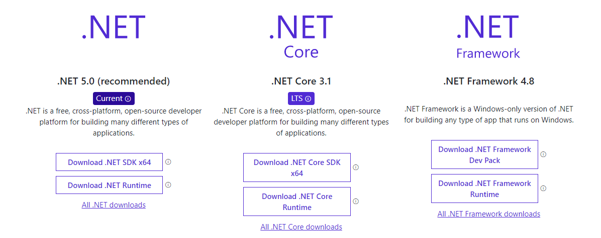

# Modelagem e Implementação de Software : REO 6

Repositório referente a *Atividade Prática 5* da matéria **Modelagem e Implementação de Software**. 

## Vamos falar de .NET?


### Instalação

Para ultilizar a linguagem, além do .NET instalado em sua máquina é necessáio ter:
 * Entity Framework Core
 * Banco de Dados SQL
 * Qualquer outro pacote NuGet necessário para seu projeto

Também é interessante ter
1. Git ou GitHub
2. Visual Studio Community 2019

### Como iniciar:

Para iniciar o aprendizado, alguns links interessantes são:

[Documentação Microsoft](https://docs.microsoft.com/pt-br/dotnet/)
[Macoratti: artigos de diversos temas](https://docs.microsoft.com/pt-br/dotnet/)
### Funcionalidades interessantes

#### O seguinte código representa a utilização de injeção de dependência em Asp .NET Core
```
private IRepository _repo;
private IFileManager _fileManager;
public HomeController(IRepository repo, IFileManager fileManager)
{
    _repo = repo;
    _fileManager = fileManager;
}
```

#### Outra funcionalidade muito usada em .NET é o uso de expressões ou métodos lambdas
`return _ctx.Posts.Where(post => InCategory(post)).ToList();`


O .NET é uma plataforma de programação desenvolvida pela Microsoft, feita para ser utilizada com C#, podendo ser utilizada para vários tipos de aplicações.


Para baixar vá em [.NET Dowload](https://dotnet.microsoft.com/download) e escolha sua versão.


